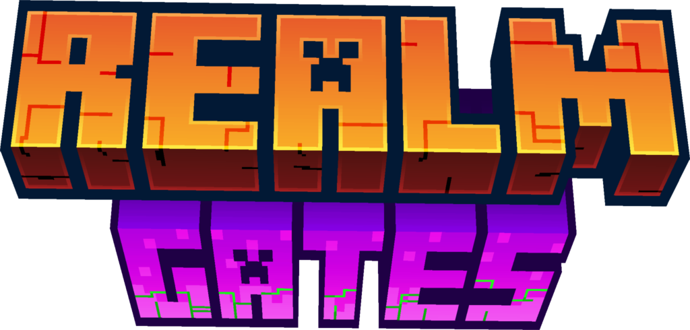

---
hide:
  - navigation
  - toc
---

  Coming soon
  ▸ The modpack &amp; server are on the way — <strong>release date to be announced soon.</strong>

  <video class="sb-hero__video" autoplay muted loop playsinline preload="auto" poster="assets/hero-poster.webp" aria-hidden="true" tabindex="-1">
    <source src="assets/hero.mp4" type="video/mp4">
  </video>
  

  

    
Forge 1.20.1 · cooperative modpack

    <h1 class="sb-hero__title sb-hero__title--logo"></h1>
    
Something is devouring the worlds. We slip from realm to realm through the gates — always one step ahead of the <strong>Blight</strong>, surviving together.

    

      <a class="md-button md-button--primary" href="mods/">Explore the dimensions</a>
      <a class="md-button" href="concepts/">Read the concepts</a>
    

  

Start here

  

    
    <h3>Install</h3>
    Opens at release — date to be announced soon.
    Soon
  

  <a class="sb-card" href="getting-started/voice-and-chat/">
    
    <h3>Voice &amp; translation</h3>
    Set your language and mic for the QSMP-style translator.
  </a>
  <a class="sb-card" href="concepts/">
    
    <h3>Concepts</h3>
    Plain-language answers to "wait, what is this?"
  </a>
  <a class="sb-card" href="mods/">
    
    <h3>Dimensions</h3>
    The realms you travel between — and every mod inside them.
  </a>

Made for this server

<h2 class="sb-section-title">Custom features you won't find elsewhere</h2>

  <a class="sb-card" href="custom/voice-translate/">
    
    <h3>Voice Translate</h3>
    Floating subtitles above a speaker's head, translated into <em>your</em> language. Text chat too. No API key needed.
  </a>
  <a class="sb-card" href="custom/realmgates/">
    
    <h3>Realm Gates</h3>
    A custom system that controls travel between dimensions and unlocks them as you progress.
  </a>
  <a class="sb-card" href="custom/custom-companions/">
    
    <h3>Custom Companions</h3>
    Build a personal companion that fights with you, levels up, and grows into your own build.
  </a>

A taste of what's inside

<h2 class="sb-section-title">Big worlds, bigger fights</h2>

{{ home_teaser() }}

<a class="md-button" href="mods/">Explore the dimensions</a>

You'll need <strong>Minecraft: Java Edition</strong> with a <strong>Forge 1.20.1</strong> instance, and the server address — ask the admin. Mod artwork © their respective authors, via Modrinth.

